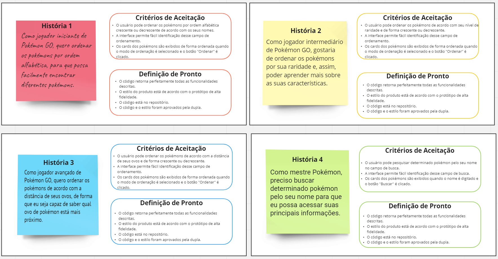
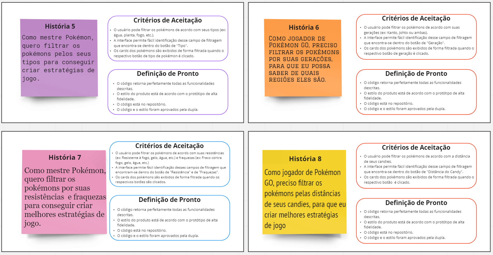
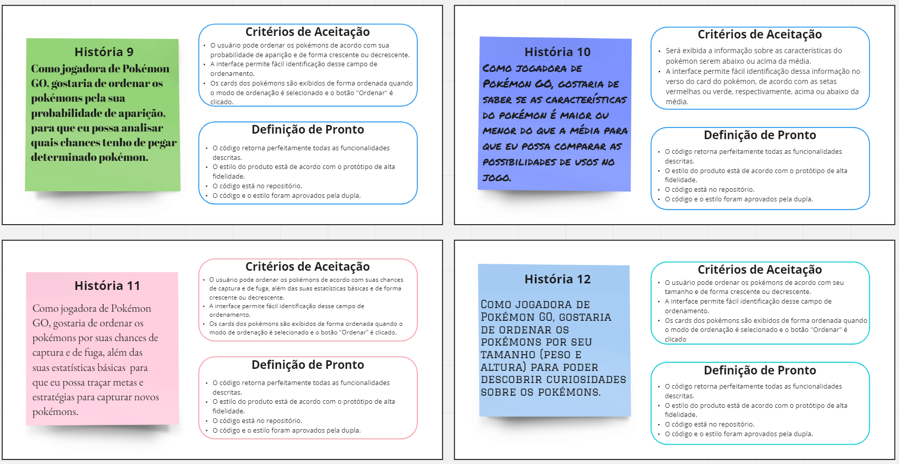

# PokeLovers :green_heart:

## Projeto 2 - Data Lovers desenvolvido no bootcamp de Front-End da SAP006 Laboratória :yellow_heart:

## Índice

* [1. Definição do Produto](#dart-definição-do-produto)
* [2. Histórias de Usuários](#pencil2-histórias-de-usuários)
* [3. Protótipos](#art-protótipos)
* [4. Como usar?](#gear-como-usar)
* [5. Links para saber mais sobre Pokémons](#link-links-para-saber-mais-sobre-pokémons)
* [6. Testes de Usabilidade](#busts_in_silhouette-testes-de-usabilidade)
* [7. Tecnologias utilizadas](#robot-tecnologias-utilizadas)
* [8. Estrutura dos Principais Arquivos](#file_folder-estrutura-dos-principais-arquivos)
* [9. Resultados](#%EF%B8%8F-resultados)
* [10. Sobre as desenvolvedoras](#woman_technologist-sobre-as-desenvolvedoras)

---
## :dart: Definição do Produto

O [PokeLovers](...) foi desenvolvido com o objetivo de auxiliar os jogadores de PokémonGo a terem uma melhor experiência dentro do jogo. Para isso, esta aplicação tem a missão de prover informações aos usuários de forma dinâmica e divertida para que estas sejam utilizadas estrategicamente na jogabilidade.

O layout do site representa a interação com uma verdadeira Pokédex (também conhecida como Poké-Agenda no Brasil) que é uma enciclopédia virtual portátil de alta tecnologia que os treinadores Pokémon transportam para registrar todas as espécies diferentes que são encontradas durante as suas aventuras. 

O seu design é responsivo para desktop, mobile (365px) e tablet (768px), o que proporcional a versatilidade desejada pelos usuários. A sua idealização foi feita a partir de protótipos de baixa e de alta fidelidade que nortearam a construção do site de acordo com as necessidades dos clientes. Nele, é possível buscar os Pokémons pelos seus nomes, filtrá-los por tipo, geração, resistências, fraquezas, distância do candy, além de poder ordená-los por raridade, distância dos ovos, probabilidade de aparição, ordem alfabética, chance de captura, chance de fuga,  tamanho (peso e altura) e estatísticas (ataque, defesa, stamina, poder de combate e pontos de vida). Existe também um campo de "Busca Avançada" onde o usuário pode realizar a filtragem integrada dos atributos com a verificação de diversos parâmetros. Em sua interface, também são disponibilizadas as informações de cada Pokémon no verso de seus cards (basta passar o mouse por cima do Pokémon), tais como tamanho, estatísticas, resistências, fraquezas e geração. Ao lado esquerdo desses cards, similarmente, existe um botão de interrogação que dá acesso a um pop-up com melhores explicações sobre as informações ditas anteriormente para auxilar àqueles usuários iniciantes.

Por fim, desejamos que nosso produto proporcione uma incrível experiência dentro do universo Pokémon! :green_heart:

---
## :pencil2: Histórias de Usuários





---
## :art: Protótipos
### Baixa Fidelidade


### Alta Fidelidade
* ####  Mobile (375px)


* #### Tablet (768px)


* #### Desktop (1440px)


---
## :gear: Como usar?
- Primeiramente o usuário acessará a página inicial, na qual, o acesso para a Pokedéx ocorre ao clicar na Pokébola;

### Na Pokedéx:
- O usuário é capaz de buscar um Pokémon pelo seu respectivo nome no campo "Busque por um Pokémon"; 
- É possível ordenar os cards em ordem crescente ou decrescente para os atributos de **Nome**, **Raridade**, **Distância dos Ovos**, **Probabilidade de Aparição**, **Chance de Captura**, **Chance de Fuga**,  **Tamanho e Estatísticas**; 
- A filtragem dos cards é independente da ordenação e os Pokemons podem ser selecionados de acordo com o seus **tipos**, **fraquezas**, **resistências** e **distância do candy**. É importante ressaltar que esses filtros são independentes entre si.
- No campo de "Busca Avançada", é possível fazer a filtragem de forma integrada e dinâmica das gerações, tipos, resistências e fraquezas.
- Ao passar o mouse em cima dos cards, os mesmos irão girar e informações adicionais serão exibidas. Quando isso ocorre, o usuário pode visualizar o **peso** e **altura** dos Pokémons, bem como as suas estatísticas **ataque-base**, **defesa-base**, **stamina-base**, **pontos de vida** e **força de combate**. Dados relativos as fraquezas, resistências e geração do indivíduo também poderão ser visualizadas e, além disso, são exibidas setas verdes ou vermelhas que informam, respectivamente, se tal informação do Pokémon está acima ou abaixo da média geral;
- À esquerda da tela, existe um botão de "Informações" para acessar detalhes dos termos exibidos na página. 

---
## :link: Links para saber mais sobre Pokémons
- [PokemonGo](https://pokemongolive.com/pt_br/)
- [PokeDéx Completa (todas as gerações)](https://www.pokemon.com/br/pokedex/)

---
## :busts_in_silhouette: Testes de Usabilidade
Durante o desenvolvimento do produto, foram realizados testes de usabilidade com diferentes indivíduos no intuito de analisar a experiência do usuário com a interface do site. Com base nos resultados desses testes, foram detectados os seguintes pontos de ajustes:

- Usuário gostaria de entender mais sobre os termos utilizados para descrever os Pokémons
- Desejo por filtros múltiplos que integrem informações 

Para a resolução dessas questões, foram implementados os campos de "Informações" e de "Busca Avançada" descritos anteriormente.

---
## :robot: Tecnologias utilizadas

| Ferramenta | Descrição |
| --- | --- |
| `HTML 5` | Linguagem de marcação |
| `CSS3` | Linguagem de estilização |
| `JavaScript` |  Linguagem de programação interpretada estruturada|
| `Jest` | Framework de teste em JavaScript|
| `Node.js` | Software de execução de códigos JavaScript|
| `Git e GitHub` | Sistemas de controle de versões distribuídos|

---

## :file_folder: Estrutura dos Principais Arquivos
```
.
├── 📁 src
|  ├── 📁 data 
|  |  ├── 📁 pokemon
|  |      ├── 📄 pokemon.js
|  |      ├── 📄 pokemon.json
|  |      └── 📄 README.md   
|  ├── 📁 images
|  ├── 📄 data.js
|  ├── 📄 index.html
|  ├── 📄 main.js
|  ├── 📄 pokedex.html
|  └── 📄 style.css
├── 📁 test
|      └── 📄 data.spec.js
├── 📄 README.md
├── 📄 package.json

```

## ✔️ Resultados


---
## :woman_technologist: Sobre as desenvolvedoras
### Patrícia Barnabé

- [LinkedIn](https://www.linkedin.com/in/patriciabarnabe)
- E-mail: patbarnabe5@gmail.com

### Laís Mune

- [LinkedIn](https://www.linkedin.com/in/laís-ayume-lima-mune)
- E-mail: aymune@hotmail.com